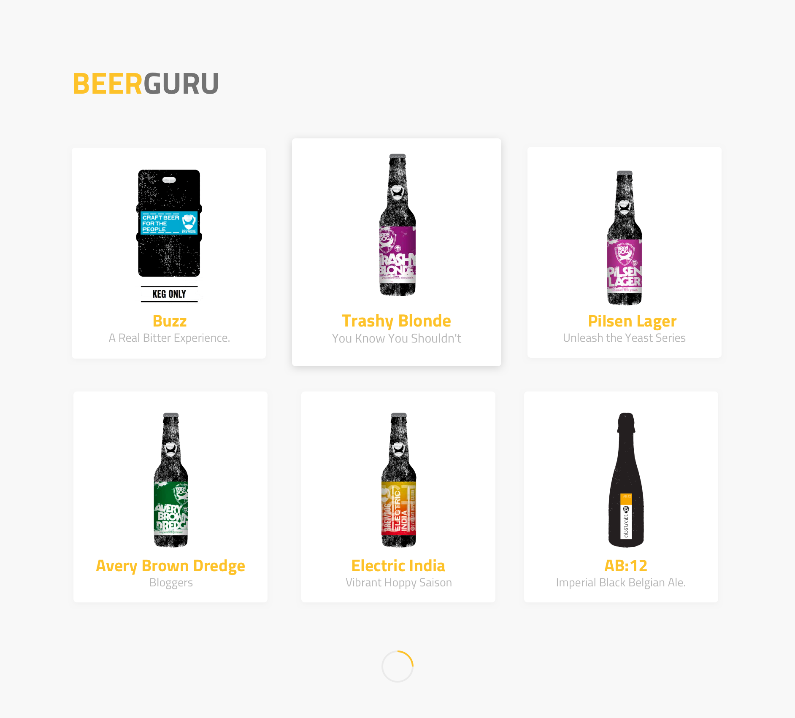
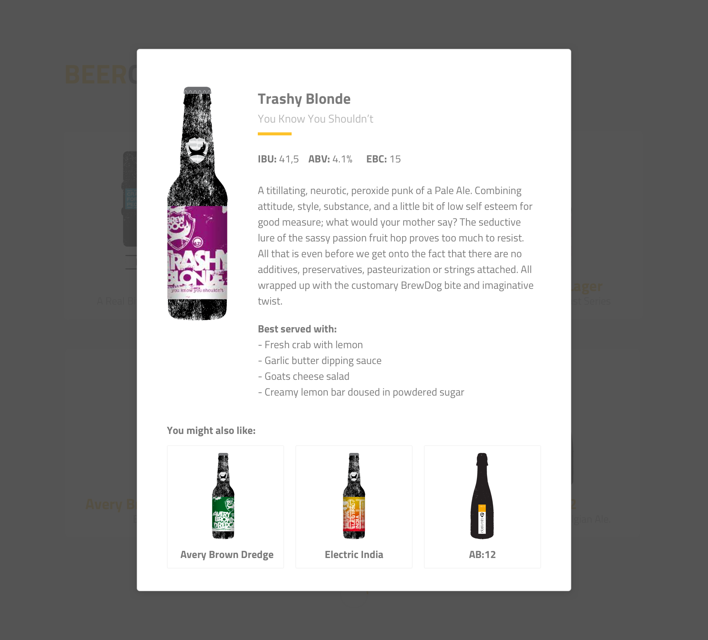

<h1 align="center">Beer Guru</h1>

<div align="center">
  <sub>The little beer advicing app. Codede by
  <a href="https://github.com/Grinzzly">Grinzzly</a>
  </a>
  <br>
  <br>
  <a href="https://github.com/airbnb/javascript">
        
  </a>
  &nbsp;
  
  <br>
  <br>
  
</div>

## About

An app that helps anybody to find the best beer in the list of imaginary beers.
`punkapi.com` API used in app to implement the data grabbing feature -
I am way too lazy to make up all those beers...really there is tons of them!

## Installation

```sh
$ npm i
$ npm run start
```

## Demo
<div align="center">
    <h3>List Page</h3>
    
    <br>
    <h3>Details Page</h3>
    
</div>

## Technologies in use

* React
* Redux
* React Router
* React Helmet
* React Loadable
* Node
* Express
